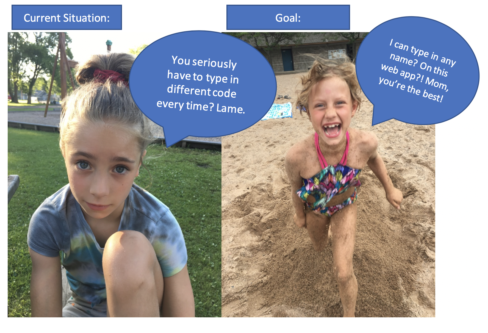

```{r setup, include=FALSE}
knitr::opts_chunk$set(echo = FALSE)
```

## What is a Shiny app?

Check out some of the examples in the shiny [gallery](https://shiny.rstudio.com/gallery/). Look at the simpler ones first. This is also a great place to learn about the various input and output options you have available when you create your app.

As we're going, I also recommend having the [Shiny cheatsheet](https://rstudio.com/resources/cheatsheets/) open. Find it near the middle of the cheatsheet page. You should also consider watching at least the first part of this [tutorial](https://shiny.rstudio.com/tutorial/) by Garrett Grolemund.

## Our first Shiny app

First, you can find all this material on my github page: https://github.com/llendway/intro_to_shiny

You should follow along by cloning my repo. Then, you'll have all the files you need!

If you haven't already, install the `shiny` library. Open the file called `basic_app_template.R`. Believe it or not, this is a shiny app! Try running the app by clicking the Run App button. You can also use the drop-down to display it in different places. What does that do?  

## Goal of this app

Create a Shiny app for my kids to explore the babynames dataset! 

Requirements: 

* Show the number of babies with a given name over time.  
* Allow the user to type a single name. (Ideally, it should give a message if there are no records of the name that was typed, but we won't worry about that now.)  
* Allow the user to choose a range of years. 
* Filter by sex.

## Goal of this app

{width=700px}


## What is an app.R file?

The file contains two key components:

* `ui`: the user interface. This is the webpage that your user with interact with. Don't worry, you don't need to know how to write html! The app will do that for you! 

* `server`: the computer part. What should the computer/server do with your inputs as the user changes them. This section will have R code in it, more like we're used to ... sort of.

These parts *always* need to have these names. The last chunk of code at the bottom, `shinyApp(ui = ui, server = server)`, will compile everything together to result in the interactive webpage.

## Make a small change to the app

Go into the `basic_app_template.R` and add some text between quotes inside the `fluidPage()` function. Run the app. What happens?

At the top of the file, also add the `tidyverse` and `babynames` libraries.


## Creating Inputs and Outputs in the `ui`

* We will add different `*Input()` and `*Output()` functions to the `ui`.  
* The `*Input*()` functions collect inputs from the user. See some of the examples on the cheatsheet.  
* The `*Output()` functions work with the `render*()` functions in the `server` part to to add R output to the UI. 

## Inputs

In the basic_app_template, add three inputs inside the `fluidPage()` function. Be sure to separate them with commas.

* `sliderInput()` to choose the start and end year for the eventual graph.  
* `textInput()` to write a name.  
* `selectInput()` to choose a sex.

In all of these functions, the first two arguments are the same: `inputId` is how you will call this input in the `server` portion later, `label` is how this will actually be labeled in your UI. Each function has some additional arguments depending what you want to do. Once you complete all the necessary arguments, run your app. Make sure you can enter and move things around as expected.

## Outputs

Now, add an `plotOutput` to the `fluidPage()` function. You need to give it the `outputId` argument, which is just a name you will refer to the output later in the server portion. 

Run the app with the output. Notice that nothing really changes. Think of this output as a placeholder. So, it knows there is going to be a plot in the UI, but the details of what the plot will look like and the R code to create it will be in the server portion. 

## Rendering outputs

In the server portion of the code, we will use `render*()` functions with R code to communicate how to use the input pieces along with the R code to create the desired output. The `render*()` function you use will depend on the desired output. Since we are interested in creating a plot, we will use the `renderPlot()` function. 

In general, this section will look something like this:

```{r eval=FALSE}
server <- function(input, output) {
  output$outputId_of_interest <- render____({
R code that may call various input$InputId's
  })
}
```

Use the inputs you've already created in the babynames app and add filtering and ggplot code to the server portion to render the desired interactive plot. Also, try adding a submit button to the UI so everything is updated at the same time, only when the button is clicked.

## Enhance the app

Try adding something more to the app. Here are a couple ideas.

1. Return a message if the user enters a name incorrectly. By the way, this will happen if someone enters a name with all lowercase letters, too. How could you solve that problem?

2. Allow the user to enter more than one name and compare the graphs either by coloring different lines or using faceting.  

3. Allow the user to change something about the graph, like the color of the line or the type of line.


## Make your own app!

Use your project data to create an interesting app!

## Publishing your app
1. Install and load the `rsconnect` library in your R Studio session. 
2. Register at [https://www.shinyapps.io/admin/#/signup](https://www.shinyapps.io/admin/#/signup).  
3. Once you are logged in to shinyapps.io, go to Account --> Tokens and click the Show button.  
4. Copy and paste the code into R. This will connect your account to R Studio. 
5. When you create an app, save it as `app.R` in a folder **ALL BY ITSELF**. It **MUST** be named `app.R` and it **MUST** be all by itself (at least I could not get it to work otherwise).  
6. Run the app. In the upper right-hand corner, there is an option to publish the app. Click on that. It will take a bit of time to do it the first time. Once published, you can go to the app via the webpage provided.

## Publishing your app

The instructions are set out in more detail [here](https://shiny.rstudio.com/articles/shinyapps.html). 

You can see the example of my sample app before it was published in the shiny_app folder of all my files (note that the `rsconnect` folder is added after publishing the app). The published app is [here](https://lisalendway.shinyapps.io/shiny_app/). 


